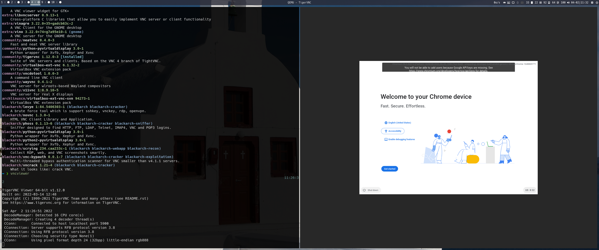
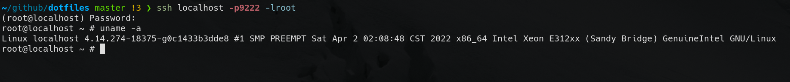
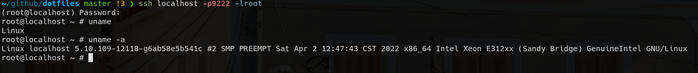
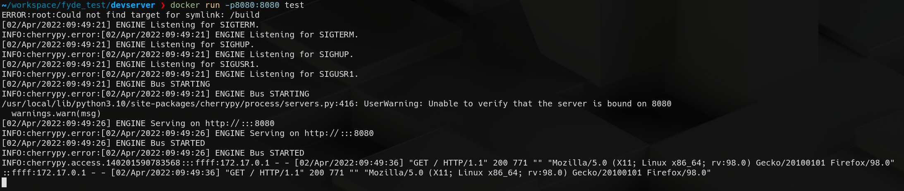
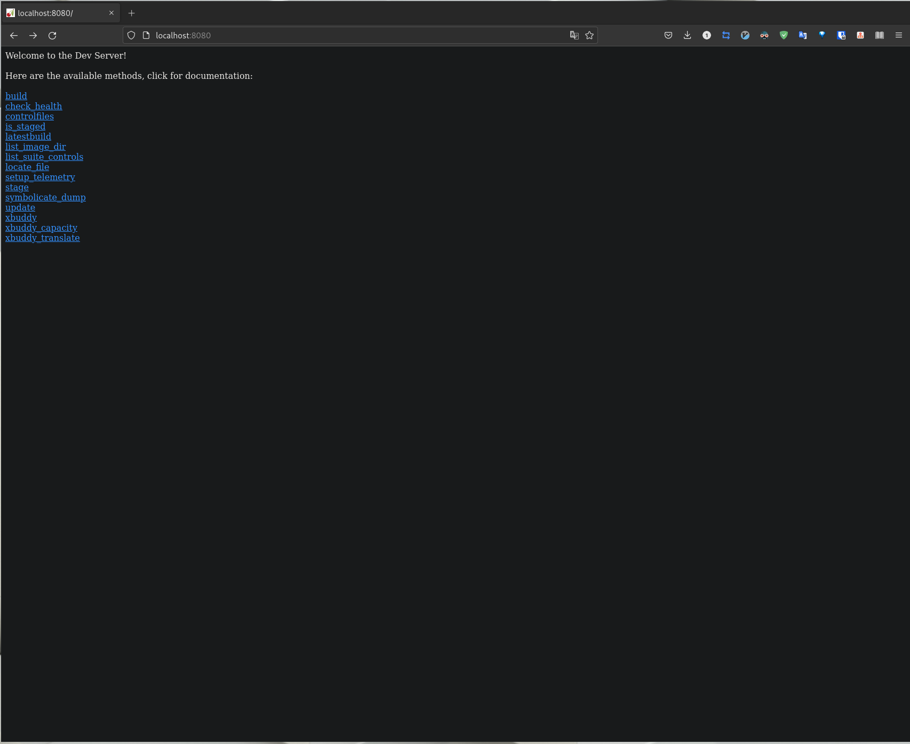
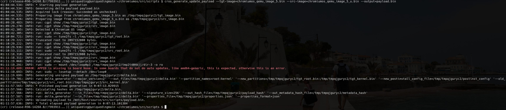
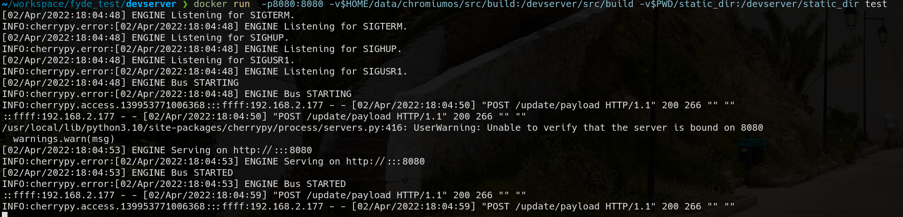
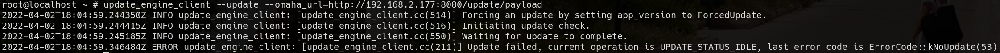

# Chromiumos build test

## 0. prepare job

### my environment

* cpu: i5-10400F
* gpu: rx5500xt
* ram: 32GB
* disk: 200GB
* host os: Arch Linux

### network 

I already have a trojan deployed on my vps, it link to my house.

## 1. Get Chromium OS code and start building

### Install development tools

`pacman -S curl git xz python python-setuptools python-virtualenv python-oauth2client`

### Install depot_tools

`git clone https://chromium.googlesource.com/chromium/tools/depot_tools.git`

`export PATH=/path/to/depot_tools:$PATH`

> I clone into github folder, so I run `export PATH=$HOME/github/depot_tools:$PATH`

### Get the Source

`mkdir ~/chromiumos && cd ~/chromiumos`

> google recommand position

`repo init -u https://chromium.googlesource.com/chromiumos/manifest -b release-R96-14268.B`

`repo sync -j4`

### start build

`cros_sdk`

(inside) `export BOARD=<your pick of board>`

> my pc is x86_64, so I run `export BOARD=amd64-generic`

(inside) `setup_board --board=${BOARD}`

(inside) `./set_shared_user_password.sh`

(inside) `./build_packages --board=${BOARD}`

(inside) `./build_image --board=${BOARD} --noenable_rootfs_verification test`

(inside) `./image_to_vm.sh --board=${BOARD} --test_image ../build/images/amd64-generic/R96-14268.80.2022_04_02_1046-a1/chromiumos_test_image.bin`

### run in qemu

start  
(inside) `cros_vm --start --board amd64-generic --image-path /mnt/host/source/src/build/images/amd64-generic/R96-14268.80.2022_04_02_1046-a1/chromiumos_qemu_image.bin`

stop  
(inside) `cros_vm --stop`

vnc connect


ssh connect


## 2. Kernel replacement

(inside) `emerge-amd64-generic sys-kernel/chromeos-kernel-5_10`

> get an error

``` text
* Detected file collision(s):
* 
* 	/build/amd64-generic/usr/lib/debug/boot/vmlinux
* 	/build/amd64-generic/boot/vmlinuz
* 
* Searching all installed packages for file collisions...
* 
* Press Ctrl-C to Stop
* 
* sys-kernel/chromeos-kernel-4_14-4.14.274-r1714:0::chromiumos
* 	/build/amd64-generic/boot/vmlinuz
* 	/build/amd64-generic/usr/lib/debug/boot/vmlinux
* 
* Package 'sys-kernel/chromeos-kernel-5_10-5.10.109-r966' NOT merged due
* to file collisions. If necessary, refer to your elog messages for the
* whole content of the above message.
* 
* When moving files between packages, you need to use blockers so portage can
* cleanly & automatically migrate files between them. Missing blockers will
* break developers & builders, so manually running `emerge -C` won't work.
* 
* If you see this for packages you aren't working on, please file a new bug
* at https://crbug.com/new so we can get the blockers added.
* 
* Please see the documentation for more details:
*   https://chromium.googlesource.com/chromiumos/docs/+/master/portage/ebuild_faq.md#How-do-I-handle-file-collisions
```

> solve: unmerge old kernel first
> (inside) `emerge-amd64-generic --unmerge chromeos-kernel-4_14`

(inside) `cros_vm --start --board amd64-generic --image-path /mnt/host/source/src/build/images/amd64-generic/R96-14268.80.2022_04_02_1046-a1/chromiumos_qemu_image.bin`

(inside) `./update_kernel.sh --remote=localhost --ssh_port 9222`



##  3. CrOS devserver in docker

### test devserver

(inside) `sudo start_devserver`

### make Dockerfile

1. copy devserver source code   

`cp -r ~/chromiumos/chroot/usr/lib64/devserver /path/to/`

2. copy chromite source code in devserver  

`cp -r ~/chromium/chromite /path/to/devserver/`

3. write Dockerfile inside  

`nvim Dockerfile`

[Dockerfile](Dockerfile)

> devserver similer can't run on root, I add a user to run.

4.  docker build

`docker build -t test .`

5. docker run

`docker run -p8080:8080 test`





## 4. Connecting the dots (failed)

### modify devserver address

`./mount_gpt_image.sh -f chromiumos_qemu_image_5.bin`

`sed 's/uniquedingmain/192.168.2.177/g -i /etc/lsb-release`

/etc/lsb-release
``` text
CHROMEOS_RELEASE_NAME=Chromium OS
CHROMEOS_AUSERVER=http://192.168.2.177:8080/update
CHROMEOS_DEVSERVER=http://192.168.2.177:8080
CHROMEOS_RELEASE_KEYSET=devkeys
CHROMEOS_RELEASE_TRACK=testimage-channel
CHROMEOS_RELEASE_BUILD_TYPE=Test Build - uniqueding
CHROMEOS_RELEASE_DESCRIPTION=14268.80.2022_04_02_1046 (Test Build - uniqueding) developer-build amd64-generic
CHROMEOS_RELEASE_BOARD=amd64-generic
CHROMEOS_RELEASE_BRANCH_NUMBER=80
CHROMEOS_RELEASE_BUILD_NUMBER=14268
CHROMEOS_RELEASE_CHROME_MILESTONE=96
CHROMEOS_RELEASE_PATCH_NUMBER=2022_04_02_1046
CHROMEOS_RELEASE_VERSION=14268.80.2022_04_02_1046
GOOGLE_RELEASE=14268.80.2022_04_02_1046
CHROMEOS_CANARY_APPID={90F229CE-83E2-4FAF-8479-E368A34938B1}
```

`./mount_gpt_image.sh -u`

### generate update payload

I want touch `/etc/uniqueding` in chromiumos_qemu_image_5_u.bin as a new image (maybe can not do like this)

`cp chromiumos_qemu_image_5.bin chromiumos_qemu_image_5_u.bin`

`./mount_gpt_image.sh -f chromiumos_qemu_image_5_u.bin`

`sudo touch /tmp/m/etc/uniqueding`

`./mount_gpt_image.sh -u`

Then grenerate update payload to payload.bin

`cros_generate_update_payload --tgt-image=chromiumos_qemu_image_5.bin --src-image=chromiumos_qemu_image_5_u.bin --output=payload.bin`



> I write an appid to the payload.bin.json
Copy payload to devserver `static_dir`

`cp payload.bin.json payload.bin.log payload.bin /path/to/docker/static_dir/amd64-generic/payload/`

### run devserver docker

`docker run -p8080:8080 -v$HOME/data/chromiumos/src/build:/devserver/src/build -v$PWD/static_dir:/devserver/static_dir test`



`update_engine_client --update --omaha_url=http://192.168.2.177:8080/update/payload`



> failed, it connect success but say no update. I try modify version but useless. Maybe my payload is incorrect.

## reference

[https://groups.google.com/a/chromium.org/g/chromium-os-dev/c/ph60qWH6Cso](https://groups.google.com/a/chromium.org/g/chromium-os-dev/c/ph60qWH6Cso)
[https://chromium.googlesource.com/aosp/platform/system/update_engine/+/HEAD/README.md](https://chromium.googlesource.com/aosp/platform/system/update_engine/+/HEAD/README.md)
[https://stackoverflow.com/questions/25845538/how-to-use-sudo-inside-a-docker-container](https://stackoverflow.com/questions/25845538/how-to-use-sudo-inside-a-docker-container)
[https://chromium.googlesource.com/chromiumos/docs/+/HEAD/developer_guide.md](https://chromium.googlesource.com/chromiumos/docs/+/HEAD/developer_guide.md)
[https://www.chromium.org/chromium-os/how-tos-and-troubleshooting/kernel-configuration](https://www.chromium.org/chromium-os/how-tos-and-troubleshooting/kernel-configuration)
[https://github.com/ds-hwang/wiki/wiki/Build-Chromium-for-Chromium-OS-and-Deploy-to-real-device](https://github.com/ds-hwang/wiki/wiki/Build-Chromium-for-Chromium-OS-and-Deploy-to-real-device)
[https://chromium.googlesource.com/chromiumos/chromite/+/master/scripts/cros_generate_update_payload.py](https://chromium.googlesource.com/chromiumos/chromite/+/master/scripts/cros_generate_update_payload.py)
[https://chromium.googlesource.com/chromiumos/docs/+/master/os_config.md](https://chromium.googlesource.com/chromiumos/docs/+/master/os_config.md)
